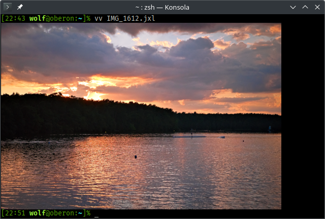
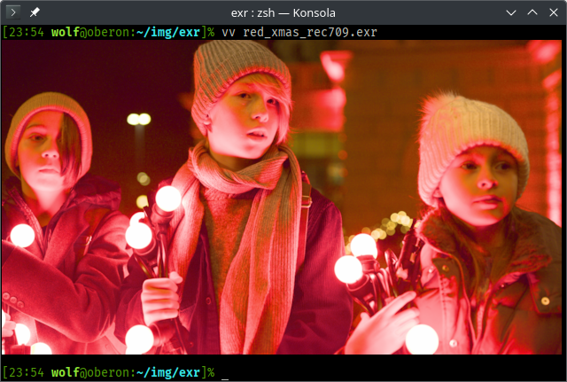
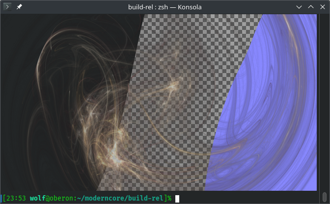
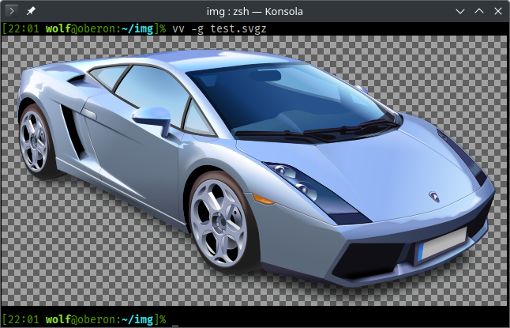
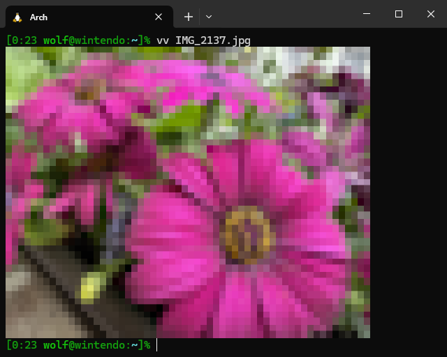

# vv - terminal image viewer

With vv you can display image files directly in your terminal. This works both locally and over remote connections. An extensive range of modern image formats is supported. Image data is displayed in full color, without any color space reduction or dithering. Images are scaled to fit the available space in the terminal. Small images can be upscaled.

## Image formats

The following types of image files can be viewed in vv:

- BC (Block Compression, also known as DXTC, S3TC), in DDS container,
- OpenEXR HDR images,
- HEIF (High Efficiency Image File Format),
- AVIF (AV1 Image File Format),
- JPEG,
- JPEG XL,
- PCX,
- PNG,
- ETC (Ericsson Texture Compression), in PVR container,
- RAW, digital camera negatives, virtually all formats,
- TGA,
- BMP,
- PSD (Photoshop),
- GIF (animations not supported),
- RGBE (Radiance HDR),
- PIC (Softimage),
- PPM and PGM (only binary),
- TIFF,
- WebP,
- PDF,
- SVG.

### Tone mapping

OpenEXR HDR images are properly tone mapped using the Khronos PBR Neutral operator.

### Transparency

Images with an alpha channel are rendered with transparency over the terminal background color. If this is not suitable, vv gives you the option to render the image with either a checkerboard background or a solid color backdrop of your choice.

### Vector images

Vector image formats, such as SVG, are rendered at a terminal-native resolution, with full transparency support.

### PDF support

For viewing PDF files, you must have the Poppler library installed on your system. This library is not used at all at build time, and is not an explicit runtime dependency of vv, unlike the other libraries.

## Terminal support

In order to be able to view images with vv, you need to use a terminal that implements the [Kitty graphics protocol](https://sw.kovidgoyal.net/kitty/graphics-protocol/). If your terminal can't do this, vv will work in a text-only fallback mode with greatly reduced image resolution.

Certain terminal features, such as Unicode fonts or true color support, are assumed to be always available.

On some terminals (e.g. Konsole), images may appear pixelated when using a high DPI monitor. This problem is caused by implementation details of the terminal itself, and cannot be fixed by vv. Try a different terminal if this bothers you.
